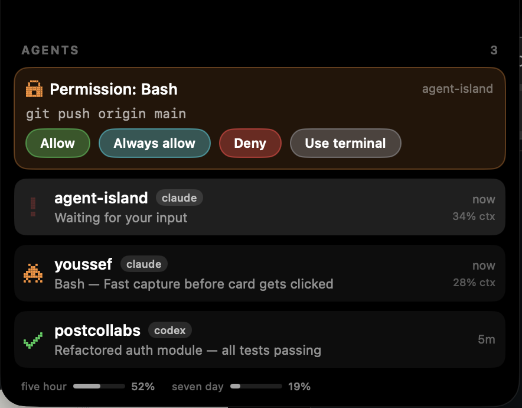

# 🏝️ Agent Island

**A Dynamic Island for your MacBook notch — built for the age of AI agents.**

Your AI agents live in terminals. You live everywhere else. Agent Island turns the wasted space around your notch into a tiny mission control: agents pop in the moment they finish, ask for permissions right on the island, and a marching 8-bit space invader tells you someone's still hard at work.

No dock icon. No window to manage. Just your notch, doing something useful for once.

<p align="center"></p>
<p align="center"></p>

## Why you'll love it

- 🕹️ **8-bit soul** — a pixel invader marches while agents work, a green check sparkles when they finish, a red `!` blinks when they need you, and every event has its own chiptune melody, synthesized live like it's 1985.
- 🔐 **Approve permissions without switching windows** — when Claude Code asks to run a command, the island pops an **Allow / Always allow / Deny** card. One click and your agent is moving again, from any app you happen to be in.
- 🟢 **Know the moment a task lands** — finish pop with a victory arpeggio, then it gets out of your way. Click a session to jump straight to its terminal.
- 👀 **Everything at a glance** — hover the notch for every active session: what tool it's running right now, subagent counts, context-window usage, and your Claude usage meters.
- 🤫 **Quiet when you're present** — pops, sounds, and permission cards only fire when you're *not* already in that session's terminal. If you're right there, prompts flow to your terminal like normal and the island stays out of your way.
- ⌨️ **Keyboard-first** — **⌃⌥A** approves and **⌃⌥D** denies the top permission card from any app, no mouse required; **⌃⌥I** toggles the island open.
- 🤖 **Plays with your whole crew** — Claude Code and Codex out of the box; anything else joins with a single JSON POST.
- 🔄 **Updates itself** — signed auto-updates via Sparkle. Install once, stay current.

## Get it

1. **[Download the latest dmg](https://github.com/0xJosep/agent-island/releases/latest)** (universal — Apple Silicon & Intel)
2. Drag **Agent Island** to Applications, then **right-click → Open** the first time (it's ad-hoc signed, not notarized)
3. Connect your agents below — 30 seconds each

## Connect Claude Code

Add to `~/.claude/settings.json` (create the `hooks` key if you don't have one). The scripts ship inside the app:

```json
{
  "hooks": {
    "SessionStart":     [{"hooks": [{"type": "command", "command": "/Applications/Agent Island.app/Contents/Resources/scripts/agent-island-hook.sh"}]}],
    "UserPromptSubmit": [{"hooks": [{"type": "command", "command": "/Applications/Agent Island.app/Contents/Resources/scripts/agent-island-hook.sh"}]}],
    "PreToolUse":       [{"matcher": "*", "hooks": [{"type": "command", "command": "/Applications/Agent Island.app/Contents/Resources/scripts/agent-island-hook.sh"}]}],
    "PostToolUse":      [{"matcher": "*", "hooks": [{"type": "command", "command": "/Applications/Agent Island.app/Contents/Resources/scripts/agent-island-hook.sh"}]}],
    "SubagentStart":    [{"hooks": [{"type": "command", "command": "/Applications/Agent Island.app/Contents/Resources/scripts/agent-island-hook.sh"}]}],
    "SubagentStop":     [{"hooks": [{"type": "command", "command": "/Applications/Agent Island.app/Contents/Resources/scripts/agent-island-hook.sh"}]}],
    "Stop":             [{"hooks": [{"type": "command", "command": "/Applications/Agent Island.app/Contents/Resources/scripts/agent-island-hook.sh"}]}],
    "Notification":     [{"hooks": [{"type": "command", "command": "/Applications/Agent Island.app/Contents/Resources/scripts/agent-island-hook.sh"}]}],
    "SessionEnd":       [{"hooks": [{"type": "command", "command": "/Applications/Agent Island.app/Contents/Resources/scripts/agent-island-hook.sh"}]}],
    "PermissionRequest": [{"matcher": "*", "hooks": [{"type": "command", "command": "/Applications/Agent Island.app/Contents/Resources/scripts/agent-island-permission.sh", "timeout": 600}]}]
  },
  "statusLine": {
    "type": "command",
    "command": "/Applications/Agent Island.app/Contents/Resources/scripts/agent-island-statusline.sh"
  }
}
```

The hook script fires-and-forgets in the background (zero added latency) and is harmless when the app isn't running. The `statusLine` entry powers the usage meters.

## Connect Codex

In `~/.codex/config.toml`:

```toml
notify = ["/Applications/Agent Island.app/Contents/Resources/scripts/agent-island-hook.sh"]
```

## Connect anything else

Any process can put itself on the island with one request:

```sh
curl -X POST http://127.0.0.1:4144/event -H 'Content-Type: application/json' \
  -d '{"source": "my-agent", "id": "run-42", "type": "finished", "message": "Deployed to prod", "cwd": "/path/to/project"}'
```

`type`: `started` · `working` · `finished` · `needs_input` · `idle` · `ended`

## Put anything on the island

Not everything worth watching is an agent. Wrap any long-running command with `island-run.sh` and it shows up on your notch — orange while it runs, a green pop when it lands, a red `!` if it fails:

```sh
alias irun="/Applications/Agent Island.app/Contents/Resources/scripts/island-run.sh"
irun npm run build
irun --name deploy ./deploy.sh prod
```

Builds, deploys, and test suites report to your notch like any agent.

## For tinkerers

It's a small Swift/SwiftUI app — no Xcode project, no asset catalogs, sprites and sounds are generated in code.

```sh
git clone https://github.com/0xJosep/agent-island && cd agent-island
swift build -c release && .build/release/AgentIsland
```

- `scripts/install-launch-agent.sh` — run the repo build at login via launchd (dev setup; the updater stays off outside the .app bundle)
- `scripts/make-dmg.sh` + `scripts/make-appcast.sh` — build the universal dmg and the signed Sparkle feed
- Endpoints: `POST /event` (status events, Claude Code hook payloads verbatim), `POST /permission` (blocks until you click Allow/Deny), `POST /status` (statusline usage data)
- Port: `4144`, override with `AGENT_ISLAND_PORT`
